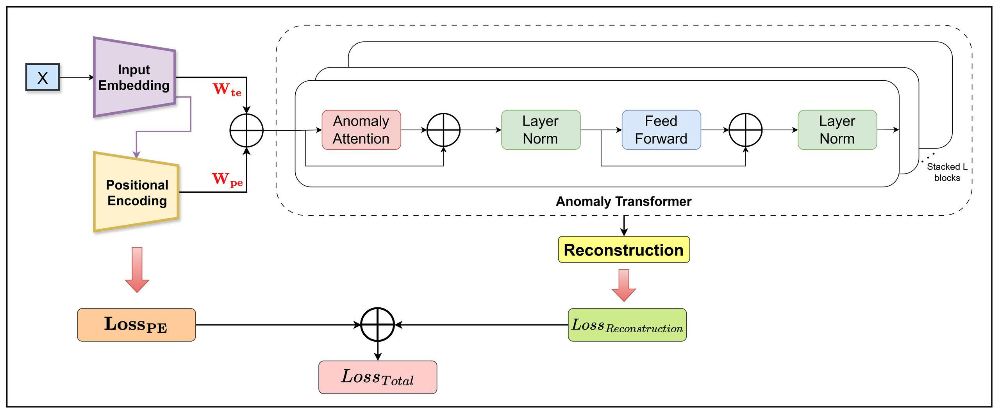
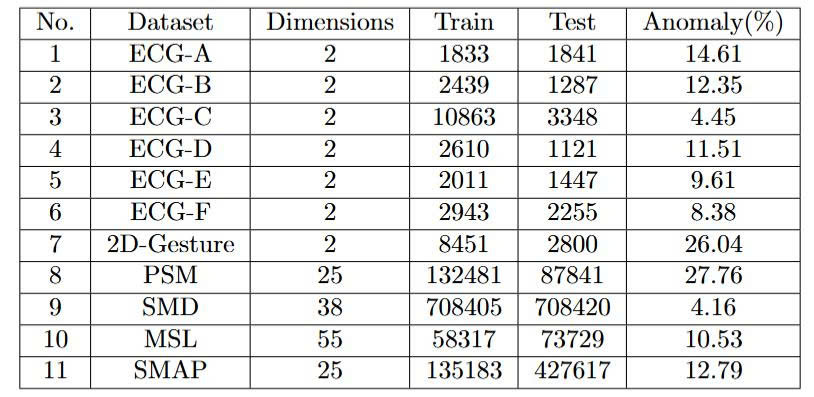
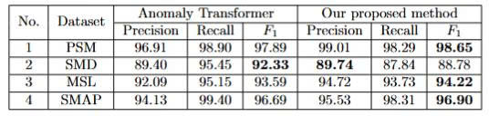
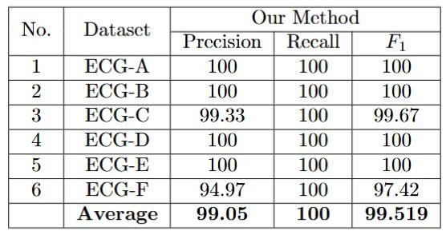

# A-New-Positional-Encoding-Loss-for-Anomaly-Transformer-in-Time-series-Anomaly-Detection

This repository contains the implementation and experimental results of our research on enhancing Anomaly Transformer model with a new Positional Encoding (PE) loss.

## Abstract
Time-series anomaly detection (TSAD) is a critical component of modern automated monitoring systems, where timely identification of unexpected behaviors is essential for preventing failures. Although Anomaly Transformer has become a strong baseline for TSAD, its performance remains constrained by the use of conventional positional encoding, which can induce positional duplication among input tokens. We introduce a positional encoding (PE) loss coupled with a learnable PE module that explicitly penalizes duplicated positional representations to enforce better temporal distinguishability. Extensive experiments on three benchmark datasets---PSM, MSL, and SMAP---demonstrate that our approach consistently improves detection performance, yielding $F_1$ gains of 0.76, 0.63, and 0.21 percentage points, respectively, over the Anomaly Transformer baseline. These results indicate that regularizing positional representations is an effective and general strategy for enhancing Transformer-based time-series anomaly detectors.

## Main Contributions

1. **Overall Architecture** 
   - Using Anomaly Transformer model as baseline, we propose a new PE loss to reduce the positional duplication minimally.
   - Achieving final results at $F_1$: 98.65\% for PSM, 94.22\% for MSL and 96.90\% for SMAP. 
   


2. **Data Embedding**  
   - Using a Hybrid Encoder to replace the original 1D-CNN-based Input Embedding.
   - Introducing a learnable Positional Encoding to learn and refine positional vectors.
   - Utilizing two coefficient vectors to adjust the contribution of input and position information.

3. **Proposed PE Loss**  
   - We propose a new PE loss to reduce mininally the positional duplication of input tokens.
   - This loss is designed based on the relationship between the similarity between two PE vectors at two timesteps and the temporal distance.
     
## Implementation

### 1. [Baseline: Original Anomaly Transformer](https://github.com/thuml/Anomaly-Transformer)
- Copy and paste the dataset and data_factory directory in our repository to the original repository.
- Run main with command-line arguments in [scripts](scripts)

### 2. [Input Embedding module: Hybrid Encoder](https://github.com/khuutrongquan/Adapting-Anomaly-Transformer-to-Constrained-Time-Series-Scenarios)
- The Hybrid Encoder is demonstrated in this source code, which is referenced from our previous paper.

### 3. [Anomaly Transformer with Proposed PE Loss](https://github.com/khuutrongquan/A-New-Positional-Encoding-Loss-for-Anomaly-Transformer-in-Time-series-Anomaly-Detection)
- Run main with command-line arguments in [scripts](scripts)

## Experimental Results

### Datasets
- Input datasets consist of eleven datasets (ECG-A => ECG-F, 2D-Gesture, PSM, SMD, MSL, SMAP)



- Dataset link: [Datasets](https://drive.google.com/drive/folders/1yv1po9kwN9mpreh82qyh33HJgGPmUEkO?usp=drive_link)


### Hardware
- GPU: NVIDIA GeForce RTX 4050 GPU

### Final Results and Comparison with Original Anomaly Transformer


### Detailed Result of ECG datasets


## Requirements

### Hardware
- CUDA-capable GPU

### Software
- CUDA Toolkit
- Python 3.7+
- Required libraries:
  ```
   torch>=1.9.0
   torchvision>=0.10.0
   numpy>=1.21.0
   scipy>=1.7.0
   scikit-learn>=1.0.0
  ```

## Authors

- Khuu Trong Quan<sup>1</sup> (khuutrongquan220405@gmail.com)
- Huynh Cong Viet Ngu<sup>2,</sup>* (nguhcv@fe.edu.vn)

<sup>1</sup>Department of Software Engineering, FPT University, Ho Chi Minh, Vietnam  
<sup>2</sup>Department of Computing Fundamental, FPT University, Ho Chi Minh, Vietnam  
\* Corresponding author

