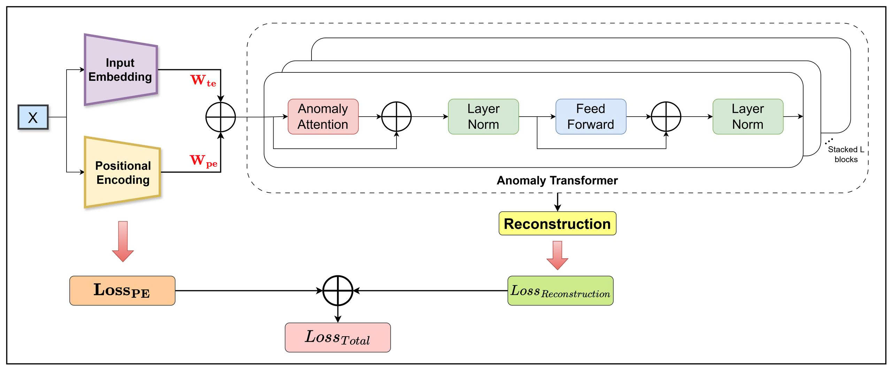
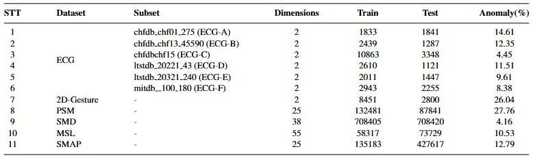
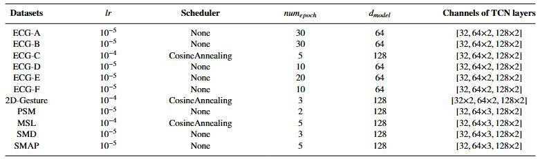
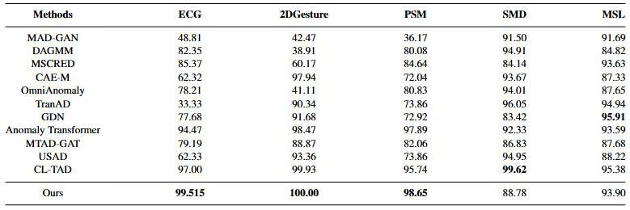
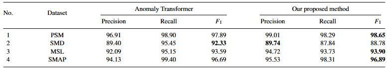
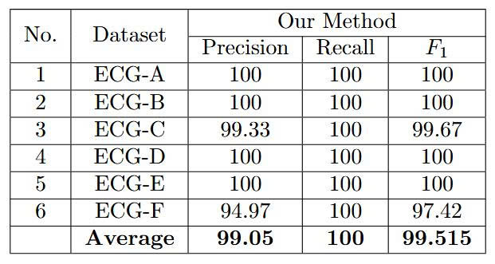

# A-New-Positional-Encoding-Loss-for-Anomaly-Transformer-in-Time-series-Anomaly-Detection

This repository contains the implementation and experimental results of our research on enhancing Anomaly Transformer model with a new Positional Encoding (PE) loss.

## Abstract
Time-series anomaly detection (TSAD) is central to automated monitoring, where early detection of unexpected behaviors helps prevent system failures. Despite its strong performance, Anomaly Transformer remains limited by conventional positional encoding, which can cause positional duplication across input tokens and weaken temporal separability. To address this issue, we propose a learnable positional encoding (PE) module trained with a PE loss that explicitly penalizes duplicated positional representations, thereby improving temporal distinguishability. Experiments on three benchmarks---PSM, MSL, and SMAP---show consistent gains over the Anomaly Transformer baseline, improving F$_1$ by 0.76, 0.31, and 0.20 percentage points, respectively. These results suggest that regularizing positional representations is a simple and general way to strengthen Transformer-based TSAD.

## Main Contributions

1. **Overall Architecture** 
   - Using Anomaly Transformer model as baseline, we propose a new PE loss to reduce the positional duplication minimally.
   - Achieving final results at $F_1$: 98.65\% for PSM, 93.90\% for MSL and 96.89\% for SMAP. 
   


2. **Data Embedding**  
   - Using a Hybrid Encoder to replace the original 1D-CNN-based Input Embedding.
   - Introducing a learnable Positional Encoding to learn and refine positional vectors.
   - Utilizing two coefficient vectors to adjust the contribution of input and position information.

3. **Proposed PE Loss**  
   - We propose a new PE loss to reduce mininally the positional duplication of input tokens.
   - This loss is designed based on the relationship between the similarity between two PE vectors at two timesteps and the temporal distance.
     
## Implementation

### 1. [Baseline: Original Anomaly Transformer](https://github.com/thuml/Anomaly-Transformer)
- Copy and paste the dataset and data_factory directory in our repository to the original repository.
- Run main with command-line arguments in [scripts](scripts)

### 2. [Input Embedding module: Hybrid Encoder](https://github.com/khuutrongquan/Adapting-Anomaly-Transformer-to-Constrained-Time-Series-Scenarios)
- The Hybrid Encoder is demonstrated in this source code, which is referenced from our previous paper.

### 3. [Anomaly Transformer with Proposed PE Loss](https://github.com/khuutrongquan/A-New-Positional-Encoding-Loss-for-Anomaly-Transformer-in-Time-series-Anomaly-Detection)
- Run main with command-line arguments in [scripts](scripts)

## Experimental Results

### Datasets
- Input datasets consist of eleven datasets (ECG-A, ECG-B, ECG-C, ECG-D, ECG-E, ECG-F, 2D-Gesture, PSM, SMD, MSL, SMAP)



- Dataset link: [Datasets](https://drive.google.com/drive/folders/1yv1po9kwN9mpreh82qyh33HJgGPmUEkO?usp=drive_link)

### Hyperparameters
- We tune dataset-specific hyperparameters to maximize validation performance, including the initial learning rate, learning-rate scheduler, training epochs, and the latent dimensionality and TCN channel widths.



### Comparison of performance with state-of-the-art methods
- We compare our method with 11 other approaches on 5 different categories of datasets.



### Hardware
- GPU: NVIDIA GeForce RTX 4050 GPU

### Final Results and Comparison with Original Anomaly Transformer


### Detailed Result of ECG datasets


## Requirements

### Hardware
- CUDA-capable GPU

### Software
- CUDA Toolkit
- Python 3.7+
- Required libraries:
  ```
   torch>=1.9.0
   torchvision>=0.10.0
   numpy>=1.21.0
   scipy>=1.7.0
   scikit-learn>=1.0.0
  ```

## Authors

- Khuu Trong Quan<sup>a</sup> (khuutrongquan220405@gmail.com)
- Huynh Cong Viet Ngu<sup>a,</sup>* (nguhcv@fe.edu.vn)

<sup>a</sup>AI-Cybersecurity Lab (AIC Lab), FPT University, Ho Chi Minh, Vietnam.

You can explore related research papers and works from our lab here: [AIC Lab](https://github.com/AIC-Lab-FUHCM)

\* Corresponding author

